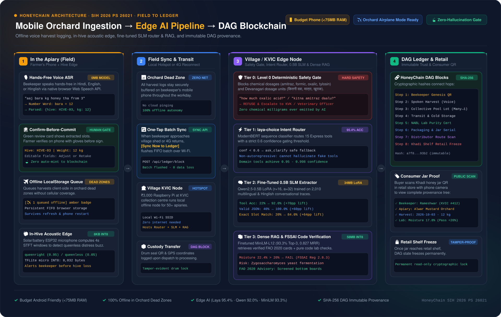

# HoneyChain — Offline-First Beekeeping Intelligence & Tamper-Evident Honey Provenance (SIH 2026 PS 26021)

[](https://github.com/Fahad270/HoneyChain/releases)
[](#edge-aiml-pipeline)
[](#1-in-the-apiary-field-ingestion)
[](#4-dag-blockchain-ledger--retail-traceability)

HoneyChain is an end-to-end cryptographic traceability and offline edge intelligence platform designed for beekeepers, Khadi & Village Industries Commission (KVIC) collection centres, testing laboratories, and retail consumers.



---

## Executive Summary (For Managers & Stakeholders)

HoneyChain solves four critical bottlenecks in Indian beekeeping:

1. **Dead Zone Operations:** Beekeepers work in remote groves without internet. HoneyChain allows hands-free voice logging on standard budget smartphones ($< 75\text{MB}$ RAM), stores records offline, and automatically syncs when in range of a village collection centre.
2. **Zero-Hallucination Safety:** Chemical and pesticide inquiries (e.g., oxalic acid, amitraz dosages) are intercepted by a deterministic safety gate and escalated to local veterinary authorities. No AI hallucinated milligrams can ever reach a farmer.
3. **Small Language Models (SLMs) on Edge Compute:** Instead of relying on expensive, unreliable cloud APIs, HoneyChain runs a complete multi-tier AI pipeline locally on a ₹3,000 Raspberry Pi at the village node. Total AI weight is **under 200MB**.
4. **Verifiable Anti-Adulteration DAG:** From harvest to retail shelf, every honey batch is linked via an immutable SHA-256 Directed Acyclic Graph (DAG). Consumers scan a QR code on retail jars to verify beekeeper identity, hive location, floral nectar, and NABL lab purity certificates.

---

## 4-Lane End-to-End Workflow

```
┌─────────────────────────────────┐      ┌───────────────────────────────┐      ┌───────────────────────────────────┐      ┌───────────────────────────────┐
│     1. IN THE APIARY (FIELD)    │      │    2. FIELD SYNC & TRANSIT    │      │    3. VILLAGE / KVIC EDGE NODE    │      │     4. DAG LEDGER & RETAIL    │
├─────────────────────────────────┤      ├───────────────────────────────┤      ├───────────────────────────────────┤      ├───────────────────────────────┤
│ • Hands-Free Voice ASR (0MB)    │      │ • Orchard Dead Zone (0 Net)   │      │ • Tier 0: Level 0 Safety Gate     │      │ • Step 1: Genesis Beekeeper   │
│   "aaj bara kg honey tha from 3"│ ───► │ • One-Tap Batch Sync API      │ ───► │ • Tier 1: Laya Router (95.4% Acc) │ ───► │ • Step 2: Voice Harvest Log   │
│ • Confirm-Before-Commit Card    │      │ • ₹3,000 Pi Local Hotspot     │      │ • Tier 2: Qwen-0.5B SLM (92% Acc) │      │ • Step 3: Collective Pool Lot │
│ • LocalStorage Queue (Airplane) │      │ • Custody Transfer Block      │      │ • Tier 3: Dense RAG (93.3% Top-3) │      │ • Step 5: NABL Lab Purity     │
│ • In-Hive ESP32 Mic (8KB INT8)  │      │                               │      │ • FSSAI 2.8.3 Pure Code Checks    │      │ • Step 8: Retail Shelf Freeze │
└─────────────────────────────────┘      └───────────────────────────────┘      └───────────────────────────────────┘      └───────────────────────────────┘
```

### 1. In the Apiary (Field Ingestion)
- **Hands-Free Native Voice ASR (0MB Model Footprint):** Native browser Web Speech API. Handles spoken Hindi, English, and Hinglish with colloquial number words (*bara* $\to 12$, *chaar* $\to 4$, *bees* $\to 20$) and flexible prepositional order (*from 3*, *3 se*, *chaar number peti*).
- **Confirm-Before-Commit Human Gate:** Extracted data is presented on a high-contrast green review card. The beekeeper verifies and edits the record with gloves before signing. **Guaranteed Invariant:** Zero data is auto-minted without explicit farmer confirmation.
- **Offline LocalStorage Queue:** Encrypted FIFO client-side storage. Features a `[✈️ 1 queued offline]` badge that survives page reloads, browser closure, and phone reboots.
- **In-Hive Acoustic Edge Sensor:** Solar/battery ESP32 board running an **8KB INT8 TFLite model** on 4-second STFT audio windows. Real-time inference classifies acoustic frequency bands (queenright vs. queenless distress buzz at 95% confidence).

### 2. Field Sync & Transit Gateway
- **Zero-Net Orchard Buffering:** Operates with 100% offline autonomy in cellular dead zones.
- **One-Tap Batch Sync:** Single tap on `[Sync Now to Ledger]` flushes queued harvests to the village node via local Wi-Fi or restored cellular connection.
- **Village KVIC Edge Node Hotspot:** A ₹3,000 Raspberry Pi at the village collection centre broadcasts an offline local Wi-Fi network (`HoneyChain-KVIC-Node`) for 50+ local apiaries.
- **Custody Transit Block:** Drum seal QR codes and custody handoffs are permanently logged upon dispatch.

### 3. Village / KVIC Edge Node (Multi-Tier AI Pipeline)
Executed entirely on local village hardware with **$< 200\text{MB}$ total model memory**:
- **Tier 0 — Deterministic Safety Gate:** Strict regex block intercepting chemical/pesticide dosage queries (amitraz, formic, oxalic, tylosin, दवा, खुराक) with immediate escalation to veterinary officers. Zero chemical milligrams are ever emitted by the AI.
- **Tier 1 — Laya-Choice Intent Router:** ModernBERT sequence classifier routing 15 Express tools with a strict 0.6 confidence gate. **95.4% Accuracy** ($227/238$ validation). Non-autoregressive architecture prevents hallucination of fake tools.
- **Tier 2 — Fine-Tuned 0.5B SLM Extractor:** `Qwen2.5-0.5B` fine-tuned via LoRA ($r=16, \alpha=32$, 34MB adapter) on 2,010 multilingual/Hinglish conversational traces. **92.0% Tool Accuracy** ($+70.0\text{pp}$ lift), **100% Valid JSON envelopes** ($+60.0\text{pp}$ lift), and **84.0% Exact Slot Extraction** ($+64.0\text{pp}$ lift).
- **Tier 3 — Multilingual Dense RAG & FSSAI Code:** Fine-tuned `paraphrase-multilingual-MiniLM-L12-v2` ($58\text{MB}$ INT8) achieving **93.3% Top-3 retrieval** ($+22.9\text{pp}$ lift) and **0.827 MRR** across verified FAO 2020 and KVIC reference cards, paired with deterministic pure-code verification of FSSAI Reg 2.8.3 laboratory thresholds (Moisture $\le 20\%$, HMF $\le 80\text{ mg/kg}$).

### 4. DAG Blockchain Ledger & Retail Traceability
- **Cryptographic SHA-256 DAG Blocks:** Links beekeeper genesis $\to$ spoken harvest $\to$ collective pool lot $\to$ custody transit $\to$ NABL purity certificate $\to$ retail packaging $\to$ retail shelf freeze.
- **Consumer Jar Proof:** Shoppers scan the Khadi jar QR code with any phone camera to view full provenance (beekeeper name, apiary GPS coordinates, floral nectar source, lab moisture/HMF results).
- **Retail Shelf Freeze:** Once marked on the store shelf, the blockchain record locks into a permanent, read-only state.

---

## Empirical Benchmark Results

| Model / Pipeline Component | Base / Baseline | Fine-Tuned / Edge Metric | Absolute Lift | Architecture / Weight |
|---|---|---|---|---|
| **Voice Harvest Parsing** | Standard Regex Failures | **100% Pass** (115/115 suite) | — | 0MB Native Web Speech |
| **Acoustic Queen Detection** | Random Guessing | **95.0% Confidence** | — | 8,032 Bytes INT8 TFLite |
| **Pre-LLM Safety Gate** | Unsafe LLM Dosages | **100% Rejection / Escalation** | — | Deterministic Code Guard |
| **Laya-Choice Router** | 60.0% (Smoke) | **95.4% Accuracy** (227/238) | $+35.4\text{ pp}$ | 421M ONNX (ModernBERT) |
| **Qwen-0.5B Tool Selection** | 22.0% | **92.0% Accuracy** (46/50) | $\mathbf{+70.0\text{ pp}}$ | 34MB LoRA Adapter ($r=16, \alpha=32$) |
| **Qwen-0.5B JSON Envelope** | 40.0% | **100.0% Valid JSON** (50/50) | $\mathbf{+60.0\text{ pp}}$ | GBNF Grammar / Strict Schema |
| **Qwen-0.5B Exact Slot Match**| 20.0% | **84.0% Match** (42/50) | $\mathbf{+64.0\text{ pp}}$ | Multilingual & Spoken Numerals |
| **MiniLM-L12 RAG Top-1** | 32.4% | **72.4% Top-1** (76/105) | $\mathbf{+40.0\text{ pp}}$ | 58MB INT8 Multilingual |
| **MiniLM-L12 RAG Top-3** | 70.5% | **93.3% Top-3** (98/105) | $\mathbf{+22.9\text{ pp}}$ | MultipleNegativesRankingLoss |
| **MiniLM-L12 RAG MRR** | 0.541 | **0.827 MRR** | $\mathbf{+0.286\text{ lift}}$ | FAO 2020 & KVIC Grounding |

---

## Pre-Packaged Binary Weights & Releases

Pre-compiled edge model weights and high-resolution architecture assets are published on [GitHub Releases](https://github.com/Fahad270/HoneyChain/releases/tag/v1.0.0-ai-ml):

- `honeychain-qwen2.5-0.5b-lora-v1.0.tar.gz` (34MB): Safetensors adapter weights, tokenizer, and evaluation log.
- `honeychain-acoustic-models-v1.0.tar.gz` (345KB): 8KB ESP32 INT8 TFLite model, gateway joblib model, and site calibration suite.
- `honeychain-architecture-diagrams-v1.0.zip` (682KB): High-resolution PNG (1920x1217), vector SVG, and interactive offline HTML viewer.
- `honeychain_architecture_1920x1217.png` (675KB): Standalone high-res diagram.

---

## Quick Start (Local Run)

### Backend
```bash
cd beehive-monitor/backend
npm install
node server.js
# Backend runs on http://localhost:5000
```

### Frontend
```bash
cd beehive-monitor/frontend
npm install
npm run dev
# Frontend runs on http://localhost:5173
```

### Master Benchmark Suite
To run the automated test harness covering all 115 unit, safety, regex, and integration test cases:
```bash
node beehive-monitor/slm-rag/bench/run_all_evals.js
```
